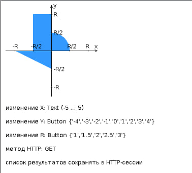

# Веб-приложение для проверки попадания точки в область

## Вариант 2000

## Описание проекта

Этот проект представляет собой веб-приложение, разработанное с использованием сервлетов и JSP, которое определяет, попадает ли заданная точка на координатной плоскости в заданную область. Приложение реализовано в соответствии с шаблоном **MVC (Model-View-Controller)**.

## Архитектура приложения

Приложение состоит из следующих ключевых компонентов:

*   **ControllerServlet:** Основной сервлет, который принимает все входящие запросы. 
*   **AreaCheckServlet:** Сервлет, отвечающий за проверку попадания точки в заданную область. Он получает координаты точки и радиус, проверяет их и возвращает результат в виде jsp страницы.
*   **Страница JSP:** Формирует HTML-страницу с отображением результата проверки.

## Требования к разработанной странице JSP

Страница JSP должна включать в себя следующие элементы:

1.  **"Шапка"**: Содержащая ФИО студента, номер группы и номер варианта задания.
2.  **Форма**: Отправляющая данные на сервер.
3.  **Набор полей**: Для задания координат точки (X, Y) и радиуса области (R) в соответствии с вариантом задания.
4.  **Сценарий на JavaScript**: Осуществляющий валидацию вводимых значений полей формы.
5.  **Интерактивный элемент**: Содержащий изображение области на координатной плоскости.
6.  **Таблица**: С результатами предыдущих проверок. Список результатов должен сохраняться в HTTP-сессии.

